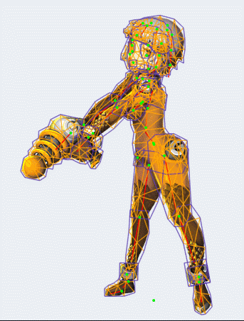
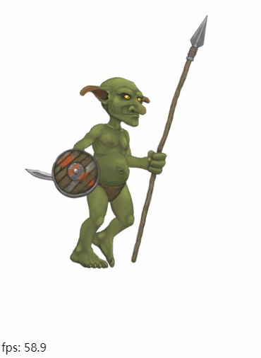

# 造轮子系列2: 骨骼动画

今天的造轮子系列, 介绍的是通过从零开始编写Spine骨骼动画的播放代码，从而更深入了解骨骼动画的基本原理。

Spine骨骼动画是2D的骨骼动画软件，它内部蕴含的骨骼动画原理`在3D模型动画`里也同样适用。

这次造的轮子还是跟以前一样，不使用任何渲染引擎(Unity,Cocos)， 使用Typescript编写骨骼动画的核心代码, 渲染层通过自己封装webgl的接口进行渲染。

轮子代码在这里： https://github.com/laomoi/spine-player
 

### 一. 为什么会有骨骼动画

先看下面这个动画：

 

如果不使用骨骼动画，那么美术同学当然也可以通过mesh deform(网格变形)来做出这个动画, 但是一旦人的动作需要调整，所有的mesh都要调整一遍， 我估计美术同学会骂街。 而且这种不同骨骼做出来的动画， 在存储动画数据的时候，每个顶点都有关键帧的信息需要存储，导致存储量巨大。

所以骨骼动画是应运而生， 它把这样的动画拆解成2部分：  

骨骼动画(rigging) +  蒙皮(skinning)

怎么理解这个意思呢？ 我们先假设角色内部是由一个骨架构成的，头发，皮肤这些就是蒙在对应的骨骼上面， 当骨骼动起来的时候， 蒙在上面的皮也会对应动起来。

像图中这个妹子的骨骼可能就只有20多根， 美术调动作只需要调整这20多根骨骼的位置就可以了，存储的也是这20根骨骼的动画信息，需要存储的信息量大大减少。

而对于某些局部的细节， 比如乳摇这样的效果， 可以通过多定义几根骨骼，用权重蒙皮来实现效果， 也可以用最原始的非骨骼方法，直接对这个局部mesh做deform动画。

所以， 骨骼动画和 非骨骼的mesh defrom动画都是美术需要的，2者其实是可以互相结合的。 而Spine软件也支持这2种做法。

本文里提到的骨骼动画原理， 不仅仅适用于像Spine这样的2D骨骼，也同样适用于3D骨骼， 主要的区别仅仅是顶点坐标多了个z深度而已。

下面这个哥布林是Spine官方提供的demo， 图片中的效果是使用本文造的轮子代码播放出来的动画效果：

 

可以看到支持了以下功能：

骨骼动画+权重蒙皮+mesh deform + 动态网格替换(眼睛部分）+ 多种插值方式

### 二. 骨骼动画的拆解

